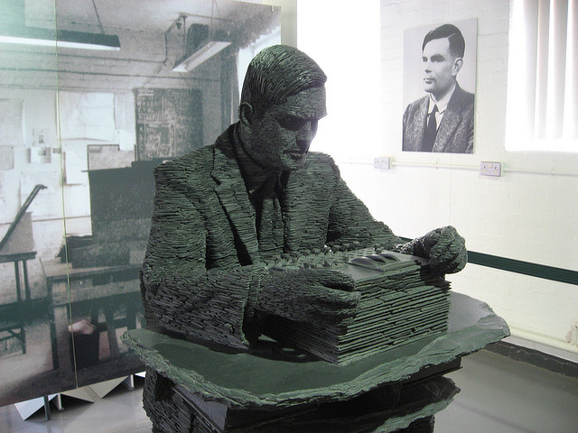
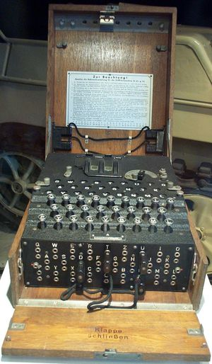
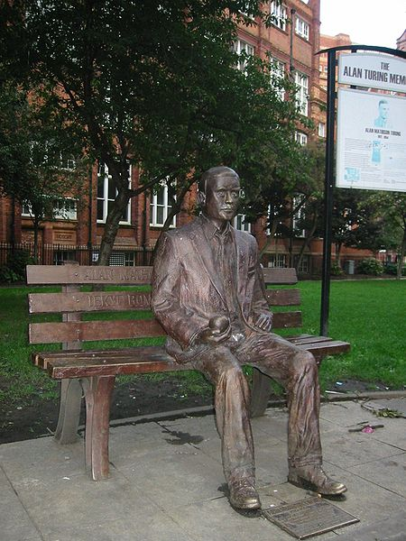

!SLIDE center
# Alan Turing (1912 - 1954)
!SLIDE center

(_Jon Callas, cc by_)

!SLIDE bullets incremental

* Brite
* Marathonläufer (5. bei olymp. Spielen 1948)

!SLIDE bullets incremental

* Logiker, Mathematiker
* Kryptoanalytiker
* einer der einflussreichsten Theoretiker der frühen Computerentwicklung und Informatik

!SLIDE center

## half mit, Enigma im 2. Weltkrieg zu entziffern 

(_OS, cc by-sa_)

!SLIDE bullets incremental

* 1936: Turingmaschine
* 1950: Turingtest
* 1953: Schachprogramm, per Hand berechnet

!SLIDE bullets incremental

* Turing war homosexuell
* 1952 wegen „grober Unzucht und sexueller Perversion“ angeklagt
* nach Verurteilung: „psychatrische Behandlung“

!SLIDE

## 1954: Selbstmord durch vergifteten Apfel

!SLIDE center
.notes Tauch den Apfel ins Gebräu / Lass den Schlaftod einziehen

> Dip the apple in the brew  
> Let the sleeping death seep through

### (Schneewittchen und die sieben Zwerge)

!SLIDE center

## Nach seinem Tod

!SLIDE center

Turing-Statue im Sackville Park 

(_Lmno, Gnu FDL, http://en.wikipedia.org/wiki/File:Alan_Turing_Memorial_Closer.jpg_)

!SLIDE bullets incremental
.notes z.B. Dijkstra, bislang kein Deutscher, meist Amerikaner, $250.000

# Turing-Award

* jährlich von der „Association for Computing Machinery“ verliehen
* „Nobelpreis der Informatik“

!SLIDE center

> So on behalf of the British government [...] I am very proud to say: we're sorry, you deserved so much better.

### Gordon Brown, brit. Premierminister, 10.09.2009 nach einer Petition
