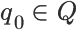

!SLIDE

# Die Turingmaschine selbst

!SLIDE center

### Erstmals formuliert in

> On Computable Numbers, with an Application to the "Entscheidungsproblem"

### (28. Mai 1936)

!SLIDE bullets incremental

* grundlegendes Konzept der Informatik
* Modell des mathematisch arbeitenden Menschen

!SLIDE bullets incremental

* drei Operationen: schreiben, lesen, bewegen
* alle mathematischen Grundoperationen möglich

!SLIDE center

> Alles, was so berechnet werden kann, ist eine turingberechenbare Funktion
!SLIDE center

### Church-Turing-These

> Die Klasse der Turing-berechenbaren Funktionen ist genau die Klasse der intuitiv berechenbaren Funktionen.

!SLIDE bullets incremental

* Halteproblem __nicht__ mit Turingmaschine berechenbar
* ↓
* auch __nicht__ von Menschen berechenbar

!SLIDE

# Formale Definition

!SLIDE center

!SLIDE smbullets left

*  ist die endliche Zustandsmenge
*  ist das Eingabealphabet
*  ist das endliche Bandalphabet und es gilt 
*  ist die (partielle) Überführungsfunktion
*  ist der Anfangszustand
*  steht für das leere Feld (_blank_)
*  ist die Menge der akzeptierten Zustände

!SLIDE

## Überspringen wir den Mathe-Hokuspokus
